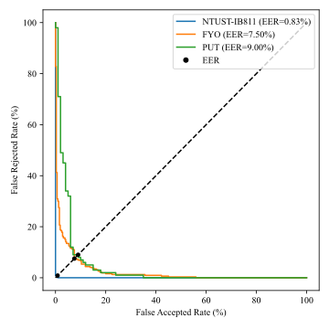
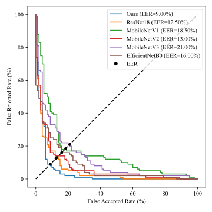

## 📝 輕量化混合孿生神經網路
此專題為我的碩士論文中靜脈辨識系統的靜脈特徵匹配程式碼與實驗數據。

使用 Python 在個人電腦上完成模型訓練、驗證與測試，並將建立的模型轉為 TFLite 格式到資源受限之嵌入式裝置上運行。

模型架構、損失函數選用、超參數設置與訓練流程皆在我的論文第 50–57 頁。[請點此到我的論文連結並到電子全文下載論文](https://etheses.lib.ntust.edu.tw/thesis/detail/2b733280676d7c87e0445313c40a9b74/?seq=2#)

### 📁 壓縮檔內容
- `results` - 本研究所有實驗結果圖與訓練好的模型。(由於 GitHub 單次上傳檔案大小的限制，資料夾內只放本研究(Ours)最佳 K 折模型與轉為 TFLite 的模型)
- `blocks.py` - 定義 models.py(模型主架構)中所用到的一些 blocks(像是卷積、深度分離卷積、殘差塊、反向殘差塊等等...)。
- `data_loader.py` - 訓練資料載入與訓練標籤製作。
- `labels_vis.py` - 將訓練標籤製作視覺化。
- `main.py` - 主程式(建模)。
- `models.py` - 各模型主架構(包含本研究架構(Ours)、ResNet18、歷代 MobileNet 與自定義的一些測試架構等等...)。
- `my_metrics.py` -  參考 stack overflow 或其他教學網站自定義的模型評估指標(像是對比損失函數、歐幾里得距離等等...)。
- `plot_all_model_db.py` - 自定義函式部分，將實驗數據資料視覺化。將所有模型的訓練結果(DET 與 ROC Curve)繪製在同一張圖上。
- `plot_ours_all_db.py` - 自定義函式部分，將實驗數據資料視覺化。將 Ours 自建的模型在三個資料庫上每一折交叉驗證的訓練結果繪製在同一張圖上。
- `plot_utils.py` - 自定義函式部分，評估指標的計算與圖表繪製(包含混淆矩陣、DET曲線上的EER等等...)。
- `requirements.txt` - Python3.9.2 用到的函式庫及其版本。

## 📁 資料庫
用來訓練模型的三個手腕靜脈資料庫分別為 NTUST-IB811、FYO 與 PUT。
- NTUST-IB811: 本研究裝置所收集之手腕靜脈影像。 [點此連結下載 ntust_ib811_wrist_vein_database 這個資料夾(共 2400 張左右手手腕靜脈影像)](https://github.com/Pathfinder1996/ntust-ib811-wrist-vein-verification-system)
- FYO: 經申請後下載。 [點此連結到資料庫申請網址或聯繫期刊作者填寫申請表格](https://fyo.emu.edu.tr/en/download)
- PUT: 經申請後下載。 [點此連結到資料庫申請網址或聯繫期刊作者填寫申請表格](https://digital-library.theiet.org/doi/abs/10.1049/el.2011.1441)

## 📦 模型架構 (點擊縮圖可放大)
- 主架構:


  
- 特徵提取子網路(Subnetwork):


- 特徵提取子網路各層參數設置:

<td></td>

## 📦 模型訓練流程圖 (點擊縮圖可放大)

<td></td>

## 📊 實驗結果 (點擊縮圖可放大)
<table border="1" cellspacing="0" cellpadding="6">
  <tr>
    <th>描述</th>
    <th>K = 1</th>
    <th>K = 2</th>
    <th>K = 3</th>
    <th>K = 4</th>
    <th>K = 5</th>
  </tr>
  <tr>
    <td>K 折交叉驗證之每折訓練與驗證損失函數曲線圖</td>
    <td></td>
    <td></td>
    <td></td>
    <td></td>
    <td></td>
  </tr>
</table>

<table border="1" cellspacing="0" cellpadding="6">
  <tr>
    <th>描述</th>
    <th>K = 1</th>
    <th>K = 2</th>
    <th>K = 3</th>
    <th>K = 4</th>
    <th>K = 5</th>
  </tr>
  <tr>
    <td>本研究模型每折在三個資料庫上測試的 DET 曲線與 EER</td>
    <td></td>
    <td></td>
    <td></td>
    <td></td>
    <td></td>
  </tr>
</table>

<table border="1" cellspacing="0" cellpadding="6">
  <tr>
    <th>描述</th>
    <th>NTUST-IB811</th>
    <th>FYO</th>
    <th>PUT</th>
  </tr>
  <tr>
    <td>各模型作為特徵提取層(皆移除Softmax)在三個資料庫上測試的最佳折 DET 曲線與 EER 比較圖</td>
    <td></td>
    <td></td>
    <td></td>
  </tr>
</table>

## 🔧 本研究訓練所使用之 GPU 規格與 CUDA 版本
- NVIDIA RTX3060 12G
- CUDA 11.2
- cuDNN 8.1.1

## 🚀 如何使用
請輸入以下指令建置 Python3.9.2 環境用到的函式庫及其版本:
```
pip install -r .\requirements.txt
```
輸入以下指令執行程式進行模型訓練:
```
python .\main.py
```
